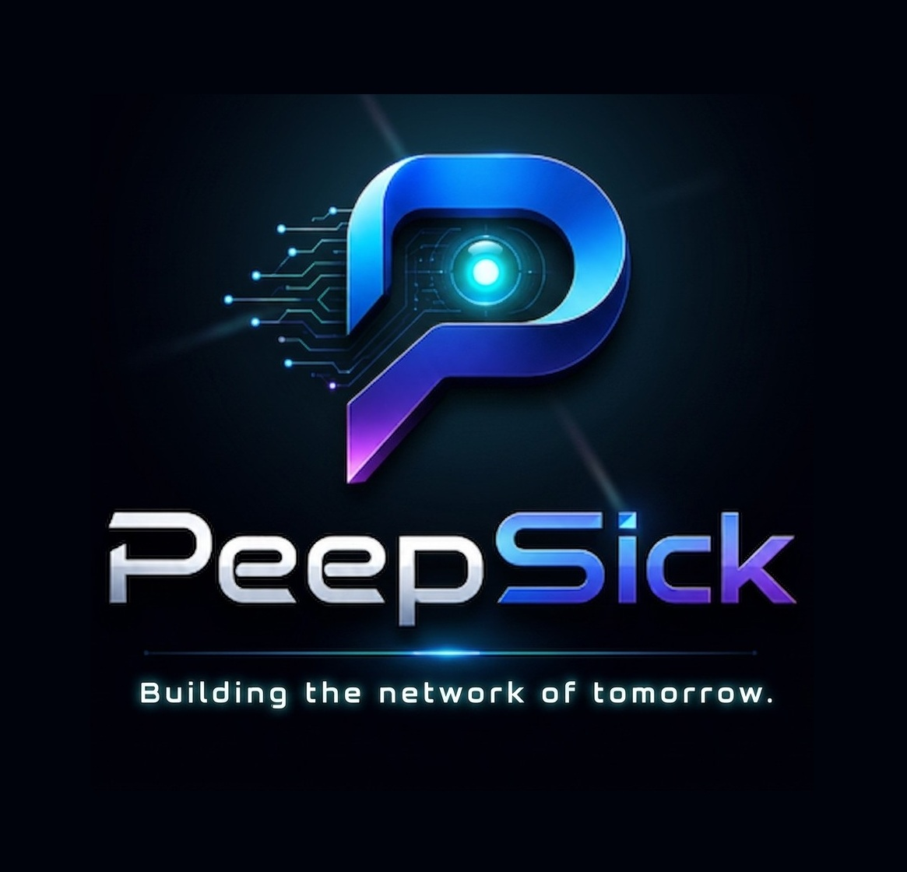

  

  ### PeepSick Labs

  **Independent AI infrastructure studio — building agent tooling in public.**

  Pre-incorporation · Bootstrapped · Small, honest tools that ship

---

### What we build

| Project | What it does | Status |
| :--- | :--- | :--- |
| 🛸 [**USB — Universal Skill Bridge**](https://usb.peepsicklabs.com) | One portable skill format, installed into 16 agent runtimes (Claude Code, Cursor, MCP, LangChain, local models) with sha256-verified installers. On npm: [`@peepsick/usb-cli`](https://www.npmjs.com/package/@peepsick/usb-cli) · [`@peepsick/usb-sdk`](https://www.npmjs.com/package/@peepsick/usb-sdk) | 🟢 Live (beta) |
| 🧠 **LeoSIS** | OpenAI-compatible LLM provider layer. | 🧪 In development |
| 🏭 **Foundry** | Multi-agent orchestration runtime. | 🧪 In development |

> **USB installs skills. Foundry builds agents. LeoSIS powers intelligence.**
> Three independent layers, one ecosystem — each ships standalone.

### How we work

- **Build in public.** No legal entity yet — we say so, instead of pretending otherwise.
- **Honest engineering.** Generated content is labeled as generated; status badges reflect things that actually run.
- **Open source first.** MIT wherever possible.

*Long-term research direction: an AI-verified trust & quality protocol for online content. A direction, not a shipped product.*

### Tech

  
  
  
  
  
  
  

### 📈 GitHub Stats

  

---

  🌐 <a href="https://usb.peepsicklabs.com">usb.peepsicklabs.com</a> · ✉️ <a href="mailto:info@peepsickai.com">info@peepsickai.com</a>

