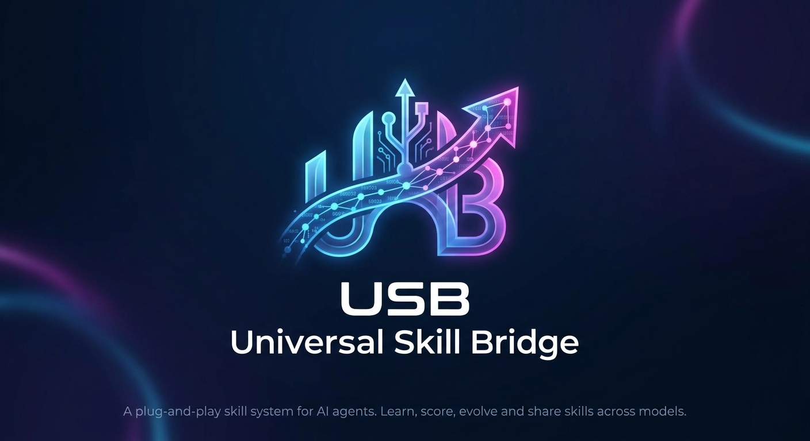

  

  ### Peepsick Labs

  **Independent AI infrastructure studio — building tools for AI agents, local AI and autonomous systems.**

  PEEPSICK LIMITED · London, United Kingdom · Bootstrapped · Building in public

---

### What we build

| Project | What it does | Status |
| :--- | :--- | :--- |
| 🛸 [**USB — Universal Skill Bridge**](https://usb.peepsicklabs.com) | A portable skill format for AI agent runtimes, with SHA-256 verified installers. Supports Claude Code, Cursor, MCP, LangChain and local models. Available on npm: [`@peepsick/usb-cli`](https://www.npmjs.com/package/@peepsick/usb-cli) · [`@peepsick/usb-sdk`](https://www.npmjs.com/package/@peepsick/usb-sdk) | 🟢 Live (beta) |
| 🎙️ [**ModelForce**](https://github.com/PeepSick/ModelForce) | Self-hosted voice infrastructure with a unified interface for multiple TTS providers, including Piper, Kokoro and XTTS. | 🟢 Active development |
| 🧠 **LeoSIS Agent** | Desktop AI agent runtime built on Tauri + LRGS, combining autonomous computer use, voice interaction, multi-agent orchestration, persistent sessions, integrations and business context. Currently running and actively tested internally across Peepsick Labs projects. | 🧪 Internal testing |
| 📬 **Keep E Box** | Agent-native, provider-agnostic mail workspace connecting major mail providers through a unified model, agent layer, policy engine and SDK. Currently running and actively tested internally. | 🧪 Internal testing |
| 🏭 **FinishOps** | Autonomous release operations console for repository auditing, release readiness, Definition of Done, technical debt and release workflows. Currently running and actively tested internally. | 🧪 Internal testing |

> **USB connects skills. ModelForce gives AI a voice. LeoSIS runs agents. Keep E Box connects them to work. FinishOps gets projects shipped.**
>
> Five focused projects, one independent AI infrastructure ecosystem.

---

### How we work

- **Build in public.** We share selected tools and experiments while keeping unreleased systems internal.
- **Honest engineering.** Status reflects what actually runs, not what is planned.
- **Open source where it makes sense.** We publish useful infrastructure and developer tools whenever practical.
- **Small teams, real products.** We focus on shipping useful systems rather than unnecessary complexity.

### About Peepsick Labs

**Peepsick Labs** is the technology studio behind **PEEPSICK LIMITED**, a UK-based software company focused on AI infrastructure, agent systems, developer tools and autonomous software.

Our work spans:

- AI agent infrastructure
- Local and self-hosted AI
- Voice AI
- Model and tool orchestration
- Developer tooling
- Autonomous workflows
- AI-native software

Some projects are publicly available, while others are actively running and being tested internally before public release.

---

### Tech

  
  
  
  
  
  
  
  

---

### 📈 GitHub Stats

  

---

  🌐 [peepsicklabs.com](https://www.peepsicklabs.com) ·
  🛸 [usb.peepsicklabs.com](https://usb.peepsicklabs.com) ·
  ✉️ [info@peepsicklabs.com](mailto:info@peepsicklabs.com)

